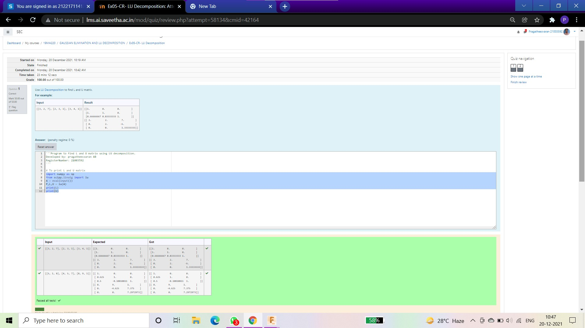
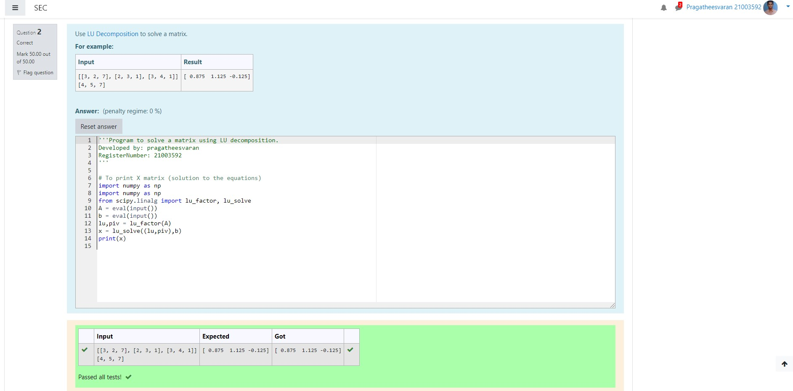

# LU Decomposition without zero on the diagonal

## AIM:
To write a program to find the LU Decomposition of a matrix.

## Equipments Required:
1. Hardware – PCs
2. Anaconda – Python 3.7 Installation / Moodle-Code Runner

## Algorithm
1. step 1: start
step 2: get an input from the user
step 3:disply the value for L and U
step 4: stop
2. step 2: get an input from the user
3. step 3:disply the value for L and U
4. step 4: stop

## Program:

Program to find the LU Decomposition of a matrix.
Developed by: pragatheesvaran
RegisterNumber: 21003592
*/import numpy as np
from scipy.linalg import lu
A = eval(input())
P,L,U = lu(A)
print(L)
print(U)

Program to find the LU Decomposition of a matrix.
Developed by: pragatheesvaran
RegisterNumber: 21003592
*/import numpy as npm
from scipy.linalg import lu_factor, lu_solve
A = eval(input())
b = eval(input())
lu,piv = lu_factor(A)
x = lu_solve((lu,piv),b)
print(x)

## Output:

## Result:
Thus the program to find the LU Decomposition of a matrix is written and verified using python programming.